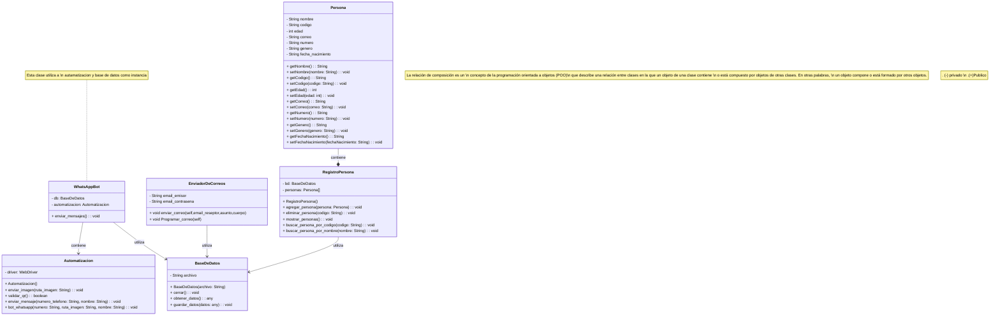

# Diagrama de clases Felicitaciones

https://mermaid.live/edit#pako:eNqNVu9u2zYQfxVCQAF7kQ07ie1GHwa0dbYvWxq0HwpsHgxKOjssJFIlqbSp4YfZM-wR-mI9_pFMK7Izw7Ap3f1-d7w73nEXZSKHKImygiq1ZHQrabniBD9caCAbIcmnB6rVm6p6KzRZReRWaUqMOpBas4J9p4SSFWJorWlJNb7ImODkiaRGJ8cv1UKRTJSCMI5onjG6igIryPoHJRIKRP74jxsMaldCMfcMitTc2sgEz6DSwqgUlFRSGIc9TEgGXNPcOCTSz2CsDu7fvx8a5Jfa-KIyyVJ0nIfmECTBbUnhgyE22mjSsRhjBuE2jS5otAPWH4G-6R__WndrXApSYcQa44gTWlLlucfklvsXFS1oiovYshws2W0jd8OL8S9p7lm1RE7PPSbdCI7JYDTEiLBHAzC048HF8L5OC5aJRjnM5Wj0K3mLfi1haROUNPl0qvcglcBdj0a_kA-wZQrNN--SNgpO95Y_MrQql_BOSAlI9gJ5l_AF9a7bb2otglIL3TEAB7IlHbLu3HtCRuSjloxvCZXZA3sUDuU-FyFi4BUSDxiGehlISeVgmJBHwfJQIlKNvsi1LXyjQPlTKN_WVOa0kdtfq_OM6tUr85oER62ikvoDtSngG0sLrCsH2IfbfpaR55uHkrJiDSVTQp4QmrBilQKnjcKF9RBPCdJLlBvugYJiEzuEBGXOp4ypqrkWcVaDrMSwA7_35_aIYdikYd8s3FZ8jewOYWm95KJMJfQIsKuxrQgFjGsCOc1Jr7Zxok_C6xKk6BFsTYL7BBvIHuiaY2GWphuJo7yDvrMem5pw-qFYtWK3r7bqnlcYMr2zWzzJ5MUuEOeZbjEshgdD1CGxEhM1Kzzlh83gaT-s2IX4vB93NtinY-PELiXnmX632TnJ5MUuh-eZfjPpvGuzeZKyq7c5fu410qnzTk88qvcUMxD0pVBUOXXsIB749z_H_azDOzhqYjjwYYvn0LMM_H9L1hMVKHBTPMC8WGOlQPsHgOrrmWmtsoPKGgfeOvufJdwD5WfOEelpl-GA2TXhG5E87Qn7yNx0gvGTdMZRA79oumQJXNHPEGzbKZhf64XzoTPUdq0TONJBJuQTpEu7PBg4hjSZbQ2zkmKNDyRezPy6N4rYlGnBzED6YsdZKkQB9MQu_PlbayhgI3ibl5icaVqYI6HXX02QaVV1jnBMehw8Q7dvc28CEcURkuHsyfEWa2O2ivQDlLCKElzmsKF1oc39Z4-qJnMfn3gWJRtaKIijusJhCv7i276tKI-SXfQtSqaXs_Hs9eJycXU9nU9vFtNZHD1FyeVkNr6ZTCbX06vXi-l8Pp_t4-i7EEgxGS9urq8u59PL-Wwxu17EEeQMJ-Kf_qJt_qyFv6y6ljXsfwLUM7zb

