# Diagrama de Flujo 🤩
https://mermaid.live/edit#pako:eNqNUl9r2zAQ_ypCz25wbDdxPBgkcdKm7djDCoPZZVzsS6JhS0aSu6YhH2hfYa_9Yj1L29jYHmaQEXe_P3enO_FK1cgzzhjbNeprdQBt2X1eSgoMv3mxkaIS6oFdXLxli2KpETQT0liQlQBWI_t4AGvmXbdQ9uHNwFk47NIzoRHPxFiAwRxzsMqwSkmGDQNdHcSj8pyl4-TF-61FiZrVDknqNRorJFjQQhmPzR12dfL6mm37qkHWgQZWQQ1_UM6OsXKMdbF6shpIXb58b1GrQd9i8_Jtp6RiRyZVu9XoTdaOcvWvhue9VS1Y6osGIz38ysGvi7sGWsIDQ_lItX1uURr4gq7n_3C9djKbv2REC3v8YbVxmJtiZTrUBIqYwX0v65_jufHj-a3x22ItJNk2flQedutSd79SnVZ7Ta4-6z4ecCq4BVHThpyGcMntAVsseUbXGnfQN7bkpTwTFGgsH46y4pnVPQa87-gRMRcwyPJsB42haAeSZyf-xLMovBzF8XQ8SZJpnCazKAn4kcJRNIqms2R8GYVxOE6S6BzwZ6VIIhxN0nGUzsI4Hcd0JmnAsRZW6Xd-i90yO49PjjAUcn4FAPbuDQ

```mermaid




    flowchart TD
   
  A[Inicio] --> B[Crear instancia de WhatsAppBot];
  B --> C[Inicializar BaseDeDatos con el archivo];
  C --> D[Obtener datos de destinatarios];
  D --> E{Iniciar bucle para cada destinatario};
  E --> F[Extraer número de teléfono y nombre];
  F --> G[Crear instancia de Automatizacion];
  G --> H[Llamar a enviar_mensaje con número de teléfono y nombre];
  H --> I[Llamar a enviar_imagen];
  I --> J[Esperar 2 segundos];
  J --> E;
  E --> K[Fin del bucle];
  K --> L[Fin del programa];
       
    
```
